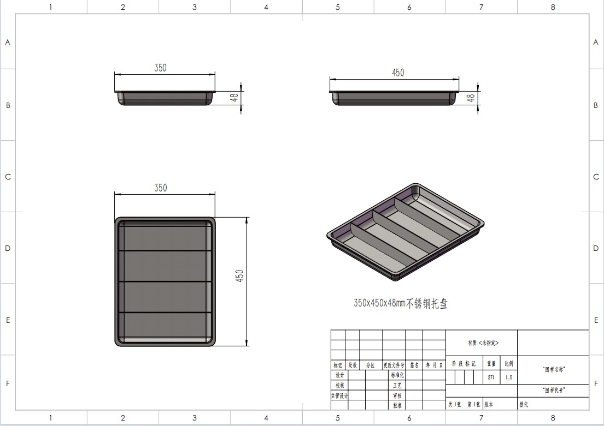

# Coffee bar layout guidelines

Confirmed design requirements and adjustable reference values for the coffee bar. Updated 8 October 2026. For editor controls, configuration and export formats, see the [editor guide](EDITOR_GUIDE.md).

## Footprint and customer-relative directions

The customer-facing long side is **5.00 m wide**. The short side, from front to back, is **3.75 m deep**. These dimensions supersede the older room envelope in saved layout proposals.

Define directions from the perspective of a customer standing at the ordering frontage and facing into the bar:

- **Left side:** ordering and the robot operating area. Arrange the robots so customers have a clear view of their work.
- **Right side:** coffee equipment, following the single-line arrangement below.
- **Front:** the customer-facing long side, including ordering and pickup.
- **Back:** the bun shelves, with the refill aisle behind them, parallel to the long side.

These directions are independent of the current SVG rotation, camera position and legacy object names. In a normalized top-down drawing with customers along the bottom, customer-left is drawing-left and the rear is at the top. Do not equate the older scene's global width/depth fields with frontage/depth without checking its orientation.

## Operator access and entry

Reserve a continuous **0.50 m clear-width thoroughfare** for operators to enter and reach the coffee equipment at the table. Measure clear width between obstructions, not between their centre lines. Plan equipment service access and door openings without occupying this reserved route.

Reserve a **0.60 m-deep strip behind the bun shelves**, running along the rear long side, for operators to refill the shelves. Interpret 0.60 m as the strip's front-to-back width. Whether this strip is included in the stated 3.75 m depth or is additional space behind it is awaiting confirmation; do not silently expand or shrink the footprint. Door locations and the connection between the coffee service route and rear refill aisle remain to be laid out.

Provide **entry doors**. The requested operating procedure is to **press the E-stop before operators enter the robot area**. Preserve that instruction in the design and entry signage.

For the physical installation, that procedure alone does not establish safe access. Have the robot-system integrator validate door interlocks, prevention of unexpected restart, and hazardous-energy isolation for servicing as part of the task-specific safety design. The 0.50 m and 0.60 m widths are requested planning dimensions, not a determination that access, servicing or egress requirements are satisfied. [OSHA's robot safety guidance](https://www.osha.gov/otm/section-4-safety-hazards/chapter-4) describes safeguarding and maintenance-energy controls; applicable local requirements still need to be established.

## Required coffee equipment arrangement

The coffee equipment must form **one line**, with the **fronts of the machines visible to customers** on the ordering/pickup side. This applies to the beverage equipment as a group, including the coffee machine, tea machine, ice machine, milk unit and lid applicator where used. The exact order and spacing remain adjustable.

The cup and lid dispensers must form a **2 × 2 cluster within that line**. Treat the cluster as one section of the equipment lineup, with space reserved for all four dispensers.

| Dispenser function | Status |
| --- | --- |
| Paper cups | Existing beverage workflow |
| Plastic cups | Existing beverage workflow |
| Paper lids | Existing beverage workflow |
| Fourth dispenser | Reserved; contents and workflow are undecided |

The particular cell assigned to each dispenser is undecided. The working interpretation is a 2 × 2 footprint viewed from above; vertical stacking has not been requested. Do not assign a function to the fourth position or remove its reserved space simply because it has no workflow yet.

Customer visibility and robot access must both be considered. Keep the robot able to reach the dispensing outlets and the access space beneath the dispenser cylinders. In particular, check access to the rear row of the 2 × 2 cluster. Orient the lineup relative to the actual customer side, rather than assuming a fixed global X/Y direction.

These requirements supersede older proposals that put machines on different legs of an L-shaped counter or oriented them solely toward the robot. Existing asset defaults and saved JSON positions may still show those older arrangements.

## Equipment and service access

- Mount tabletop coffee equipment and the beverage robot on their supporting counter. The **HZ-D01 tea machine is floor-standing**, with a reference envelope of **60 cm wide × 70 cm deep × 152 cm high**. Include it in the lineup at floor level. Keep the legacy tabletop tea machine available as a separate option.
- The **ice machine's front is on its short side**. Its controls and dispensing/service face must follow that side when the object rotates.
- Cup and lid dispensers need approximately **30 cm of clear height above the worktop beneath the dispenser body**, a metal base plate bolted to the table, and a rear support. The initial overall height is approximately **70 cm above the table**. Preserve access for the robot's cup prong and held cup when arranging the cluster.
- The beverage tool has a circular cup prong with an **85 mm inner diameter** and an opposite tapered lid stamper attached directly to the wrist housing, following the supplied reference. The beverage Nova-5 is the upgrade option; existing Nova-2 layouts remain valid historical variants.
- Use the actual machine outlet and dispenser underside as service targets where known. The earlier **lower 25% of machine height** target is an illustrative fallback, not a measured outlet specification. The HZ-D01 outlet position is also provisional pending measurements.
- Machine top labels run parallel to the machine's long side. Text orientation does not define the machine's front or robot service direction.

## Customer frontage

Ordering and pickup belong on the same customer-facing long side. Put ordering on the customer's left beside Atom-W, with pickup nearer the coffee equipment on the customer's right. **Left work counter** is the historical ordering counter's object label; its name does not override the customer-relative directions above.

The transparent plastic barrier includes an adjustable pickup opening and an ordering section with a tablet, combined mic/speaker and instructions. The tablet and mic/speaker sit on a housing that projects toward the customer with an inclined face. Keep the pickup opening aligned with the placement area.

Reference dimensions are **90 cm** for the ordering counter, **80 cm** for the original coffee worktop/cart, **1.7 m total barrier height**, and a **1.7 m human** for scale. These are editable reference dimensions; barrier height above a worktop depends on that worktop's elevation. Atom-W is mobile and its base footprint is **70 × 51 cm**.

## Bun shelves and tray arrangement

Place the bun shelves at the back, with access from the rear refill strip. The new proposal replaces the earlier six-column starting point:

| Item | Proposed arrangement |
| --- | --- |
| Tray | Stainless steel, solid base, **350 × 450 × 48 mm** outer dimensions |
| Divisions per tray | **Four channels**, formed by three internal dividers |
| Trays per tier | **Two**, side by side |
| Columns per tier | **Eight** in total |
| Tiers per rack | **Three** |
| Trays per rack | **Six** in total |

To make eight front-to-back columns, orient each tray with its **450 mm dimension across the rack** and its **350 mm dimension running front to back**. This is rotated 90 degrees from the top view in the supplied drawing. Two adjacent trays therefore occupy a nominal **900 mm across × 350 mm deep** envelope before slope, fit clearance and rack framing. If retaining the earlier 950 mm outer rack width, only 50 mm total remains across the width for posts, gaps and mounting allowances, so actual fit needs checking.

With equal spacing, 450 / 4 = **112.5 mm gross column pitch**. This is not the clear bread width: subtract the rims, divider thickness and any taper using measured tray geometry. The drawing does not dimension those losses. The two central tray rims also occupy space. Eight columns across three tiers are 24 column positions, not a statement that the rack holds only 24 buns.

Retain the earlier approximate **40 cm tier spacing** and **10 cm back-to-front drop** as adjustable reference values. Measure rack heights from the **lowest front underside edge**. Column count, tray/tier arrangement, bread size, spacing, slope and bottom clearance remain design parameters; the new proposed defaults are two four-column trays and three tiers. Tray height of 48 mm is separate from the 100 mm installed slope drop. Use the tray's actual tilted geometry when checking the projected footprint and overhead clearance.

## Adjacent bag operations

- A shared packing table supports the bread Nova-5 with tongs, the suction Nova-5 and the bag fixtures, with adjustable positions relative to the table. The suction tool is **80 × 80 mm across its face and 100 mm long**, with four cups. The opposing fixture uses the same gripper envelope mounted on a backplate.
- Store flattened bags horizontally in a passive open-top holder with a front cutout. Pick the top bag, lift clear and turn it upright before opening against the opposing suction. Use measured folded-bag dimensions and stack height; paper GSM alone does not determine either.
- Bread pickup uses a side grasp that clears the metal shelf base. The bag must be open before bread insertion, and the filled bag must stay in place until the bun is deposited and the bread arm is clear. Bag opening and bread pickup may overlap when their coordinated paths are valid.

## Applying the guidelines to a scene

Use the latest scene export for object dimensions, transforms, supports, workflow assignments and visibility, applying the newer requirements here when they differ. A saved placement is a particular design state, not a permanent design requirement. The checked-in [Nova-5 and floor-tea layout](layouts/coffee-bar-nova5-floor-tea.json) records an earlier L-counter proposal and does **not** establish compliance with the new footprint, single-line arrangement, access routes or tray arrangement. Recording a requirement here does not change the live scene or its geometry automatically.

Plan coordinates use X to the right and Y downward; displayed positive rotation is clockwise. Width and depth are local dimensions before rotation. JSON dimensions are in metres, angles in degrees, and the SVG scale is **2 px = 1 cm**. Machine front-face markers use local **−Y** in the editor. Follow support relationships when resolving equipment elevations and moving a table.

After rearranging equipment, check the full robot path with the selected tool and held cup or bag, including approach, withdrawal, transfer and pickup placement. Reach circles or spheres illustrate range; they do not prove IK or collision clearance. Maximum effective reach adds tool length to working radius; realistic placement reach uses working radius × 70/85 without adding tool length. The configured **1.5 m/s beverage speed limit applies to the end-effector**, not joint angular speed.

Still to decide: inclusion of the rear refill strip within the footprint, door locations and access-route connections, the precise equipment order and spacing, the dispenser cell assignments and fourth dispenser function, measured tray clear widths and mounting fit, and measured service/outlet locations for the purchased machines. Keep these configurable rather than turning current placeholders into fixed requirements.
