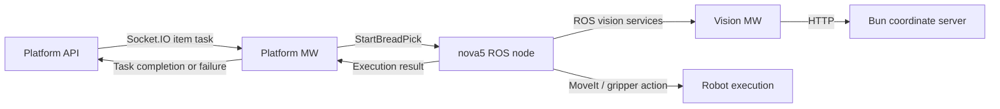

# Nova-5, vision, and existing simulation

Read-only survey of the 2026-09-18 working copies. See [snapshot metadata](README.md). No ROS node, service, simulator, or hardware connection was launched.

## nova5_ros2

The implemented production path is:

The C++ node orchestrates capture/aim/grasp checks through ROS vision services. The vision MW translates those requests to HTTP; it does not own the platform task assignment or choose the production placement destination after the first grasp check.

- [platform_bridge/mapping.py](../../../nova5_ros2/src/platform_bridge/platform_bridge/mapping.py), lines 12-39, maps racks to numeric IDs, validates level/slot in 1-3, and maps task.counter_area through configured counter_slots into place_slot.
- [StartBreadPick.srv](../../../nova5_ros2/src/bread_interfaces/srv/StartBreadPick.srv), lines 1-41, defines the request. The controller accepts/queues the request asynchronously and runs motion in its worker.
- [main.cpp](../../../nova5_ros2/src/lebai-ros-sdk/dobot_lebai_control/src/main.cpp), lines 500-558, validates/maps the location; lines 634-732 evaluate up to ten candidates through alignment, J6 rotation, and tool-Z approach planning. The first fully planable candidate is selected. Older README descriptions saying it uses only the first result are stale.
- The same file, lines 734-915, handles pickup, closure, lift/retraction, holding pose, and first grasp check; lines 949-1175 handle placement, the second grasp check, release, retraction, home, and completion.
- [bread_vision_client.cpp](../../../nova5_ros2/src/lebai-ros-sdk/dobot_lebai_control/src/bread_vision_client.cpp), lines 258-300, contains request_drop_position(), but the production worker does not call it. Production placement derives from StartBreadPick.place_slot and taught joint poses. [readme.md](../../../nova5_ros2/readme.md), lines 80-81, and [bread_cell_nodes/README.md](../../../nova5_ros2/src/bread_cell_nodes/README.md), lines 227-239, identify the drop-position service as diagnostic/legacy.

The platform API already owns counter assignment, and platform MW preserves it through configuration. What remains unresolved is compatibility between four platform counters and the Nova controller's three placement codes, the destination mapping, and occupancy validation. Per the user's clarification, counter and box are the same destination; there is no separate placement-cell entity. The inspected path has no vision verification that the bun arrived at the destination.

[platform_bridge.json](../../../nova5_ros2/src/platform_bridge/config/platform_bridge.json), lines 18-19, ships empty item_labels/counter_slots mappings. [settings.py](../../../nova5_ros2/src/platform_bridge/platform_bridge/settings.py), lines 56-61 and 173-190, requires maps for an enabled platform connection and restricts mapped placement codes to 1-3. Counter 4 has no intrinsic placement mapping: configuring an alias is a physical-layout decision, not a safe automatic conversion.

Successful placement ends only after verified home at main.cpp lines 1172-1174, followed by terminal evidence and complete_success at lines 1928-1979. Missing terminal diagnostics are advisory after verified delivery; a parsed nonempty alarm list holds the controller. The current lifecycle status does not publish every normal motion phase, so a detailed viewer may need additional observations or instrumentation.

Retries are layered: native grasp attempts, a local home restart, vision MW attempts, an HTTP 408 aim retry, fresh-capture retries on empty detection, and platform task retries. The two grasp checks share a vision attempt index. A simulator needs separate counters and correlated traces for these layers; the brief's shared retry policy should not be assumed to match all current code.

### Existing fake hardware and missing dependencies

[combined_real.launch.py](../../../nova5_ros2/src/lebai-ros-sdk/dobot_lebai_control/launch/combined_real.launch.py) already has a use_fake_hardware branch with ros2_control, controllers, joint publication, and MoveIt. [fake_ros2_controllers.yaml](../../../nova5_ros2/src/lebai-ros-sdk/dobot_lebai_control/config/fake_ros2_controllers.yaml) supplies the arm trajectory controller and gripper action controller.

This is a strong starting point for retaining the real C++ workflow. It is not a complete simulation profile. The controller also subscribes to custom Dobot /joint_states_robot feedback and expects RobotMode and GetErrorID vendor services ([main.cpp](../../../nova5_ros2/src/lebai-ros-sdk/dobot_lebai_control/src/main.cpp), lines 201-203 and 310-417). Generic fake joint feedback does not supply those interfaces. Add explicit simulated health/feedback services and verify home/readiness/fault behavior, or introduce a defined health adapter. Preserve actual MoveIt planning scenes and the gripper action contract.

The documented baseline is Ubuntu 22.04 with ROS 2 Humble, MoveIt 2, and control dependencies. At review time, the ROS packages were not installed in the inspected WSL distribution. See the subsequent [base environment setup log](../environment-setup-log.md) for installation results. Project build feasibility is not yet demonstrated.

### Vision protocol, health, and operator tools

[vision_server.py](../../../nova5_ros2/src/bread_cell_nodes/bread_cell_nodes/vision_server.py) implements the ROS vision MW. It combines base_link-to-Link6 TF with hand-eye calibration, sends /extrinsics and /aim, flattens/filter-validates candidates, and returns at most ten results. [BreadVisionResult.msg](../../../nova5_ros2/src/bread_interfaces/msg/BreadVisionResult.msg), lines 1-9, defines the ROS result boundary: Cartesian metres, absolute J6 degrees, and tool-Z distance metres. HTTP orientation uses radians and server width fields use millimetres. Tests must assert both frame identity and units.

The vision MW emits diagnostic heartbeat logs. Platform MW polls the bun server /health and can send fast/slow platform telemetry; health observation alone does not gate dispatch ([health.py](../../../nova5_ros2/src/platform_bridge/platform_bridge/health.py), lines 61-64; [ros_node.py](../../../nova5_ros2/src/platform_bridge/platform_bridge/ros_node.py), lines 324-330 and 365-380; [telemetry.py](../../../nova5_ros2/src/platform_bridge/platform_bridge/telemetry.py), lines 97-118). These mechanisms are not the same as a platform-initiated application ping that proves every dependent process is responsive.

The existing [cell_console](../../../nova5_ros2/tools/cell_console/README.md), lines 12-25 and 36-74, owns/observes Python processes and observes the C++ node. It displays health age, heartbeat, journal/traces, recovery actions, and process state. It does not start pick requests or automatically restart failed processes. Reuse its diagnostic concepts; keep a headless test runner independent of the interactive console.

## bun-coordinate-server

This is the real HTTP vision service to preserve in the integration loop. Important routes are /detect, /aim, /grasp_check, and /health. It performs fresh capture retries for empty detections and provides calibration/aim/grasp processing.

Existing [tools/replay_capture.py](../../../bun-coordinate-server/tools/replay_capture.py), recorder artifacts, and internal test_grasp_frame support provide offline/testing pieces. They do not currently expose a production camera-injection route that sends a synthetic RGB-D frame through the complete HTTP /aim path.

Recommended seam: select a capture provider explicitly and feed real CaptureBundle-compatible colour/depth/intrinsics/extrinsics data to the service. Preserve the HTTP API and vision calculations. Scripted final aim/grasp responses remain useful for narrow protocol tests but cannot stand in for the camera-only mock required by the brief.

The concrete seam is [api/broker.py](../../../bun-coordinate-server/api/broker.py), lines 758-835, where the broker calls pipeline.capture(), then crops/segments/builds objects while preserving CaptureBundle. [api/service.py](../../../bun-coordinate-server/api/service.py), lines 903-960, implements /aim over detection and aiming geometry; lines 1007-1047 implement frozen-frame grasp checks only. Keep the real post-capture pipeline when adding a simulated capture provider.

The recorded-frame provider and synthetic-frame provider must preserve depth scale, colour/depth alignment, timestamps, camera intrinsics, tool pose and frame conventions. Include empty/stale/corrupt observations as distinct failure scenarios. Full synthetic imagery through the real detector/model remains to be evaluated; deterministic geometry alone does not guarantee useful detector output.

## robo-cvstudio

The SeeGrasp application has a hardware-independent Python simulation backend and useful visual/sensor assets:

- [seegrasp/robot/sim/backend.py](../../../robo-cvstudio/seegrasp/robot/sim/backend.py) implements simulated robot behavior and injected faults without vendor sockets.
- [seegrasp/vision/synthetic.py](../../../robo-cvstudio/seegrasp/vision/synthetic.py) provides deterministic RGB-D scenes, bun geometry, occlusion, and ground truth in SI metres.
- [README.md](../../../robo-cvstudio/README.md) describes an independent Python 3.12 simulator and notes that its FK model has not been verified against the real controller.

Reuse its scene/camera generation and visualization after aligning them to ROS TF and the MoveIt robot model. Replacing the nova5 ROS node with this separate Python workflow would leave the production C++ sequence untested. A viewer bridge should consume authoritative simulated state; a second independently animated robot should not become a competing source of truth.

## Follow-up: existing recovery and identity safeguards

The post-release/home-failure path already avoids automatic repeated placement. [main.cpp](../../../nova5_ros2/src/lebai-ros-sdk/dobot_lebai_control/src/main.cpp), lines 1147-1174, records RELEASED after gripper-open success. If home fails, the ledger retains that disposition while awaiting recovery (lines 1622-1637 and 1995-2023). An allowed RETRY_STEP invokes run_home_after_release(), which only retries the home movement (lines 1254-1276 and 1887-1892). Unresolved/unsafe/exhausted recovery holds the controller not-ready (lines 1676-1745). [executor.py](../../../nova5_ros2/src/platform_bridge/platform_bridge/executor.py), lines 272-325, journals the terminal result and preserves the not-ready gate. A duplicate delivery from this particular automatic home-recovery path was not found. Keep it as a regression scenario, not a claim that the protection is missing.

A distinct ambiguity exists before commanded release: after a previously confirmed hold, the ordinary cycle's second grasp-check RETRY changes disposition to NOT_ACQUIRED and starts another grasp attempt (main.cpp lines 1091-1122). The [CheckBreadGrasped.srv](../../../nova5_ros2/src/bread_interfaces/srv/CheckBreadGrasped.srv) contract treats RETRY + NOT_ACQUIRED as not held. That observation alone does not prove where a dropped bun ended up. Exercise a false-negative/drop-near-destination scenario before accepting this as safe re-fulfillment. The separate run_delivery_from_held() recovery branch faults on a failed hand check and does not automatically start a new pickup (main.cpp lines 1205-1214).

Execution identity is already preserved from the platform to the native controller. [executor.py](../../../nova5_ros2/src/platform_bridge/platform_bridge/executor.py), lines 74-120, keys work by session/task/retryCount; [journal.py](../../../nova5_ros2/src/platform_bridge/platform_bridge/journal.py), lines 79-97, durably assigns one execution ID. [ros_node.py](../../../nova5_ros2/src/platform_bridge/platform_bridge/ros_node.py), lines 138-145, copies it into StartBreadPick. Lost start acknowledgments are queried by the same ID without re-sending the start (executor.py lines 170-177). After bridge restart, in-flight work is held for reconciliation; terminal results replay without motion. Native lifecycle records themselves are in memory, so the durable bridge journal is essential when the C++ process restarts.

Vision is the narrower correlation gap. CheckBreadGrasped requests contain attempt_index and label, but not execution_id or check phase, and capture IDs are not linked to the platform/native ID. Preserve existing execution identity and consider extending it across this boundary rather than inventing a new execution ledger for Nova.

Current native limits, expressed precisely:

- Three physical grasp attempts per accepted cycle, equivalent to two retries (main.cpp lines 212-214 and 1020-1038).
- At most one eligible pre-acquisition HOME_AND_RETRY and two eligible RETRY_STEP recoveries, under a 1200-second execution deadline ([recovery_runtime_guard.hpp](../../../nova5_ros2/src/lebai-ros-sdk/dobot_lebai_control/include/dobot_lebai_control/recovery_runtime_guard.hpp), lines 83-110).
- Eligibility depends on physical disposition, phase, fault category, and fresh driver evidence; post-release same-step retry is home-only ([recovery_policy.py](../../../nova5_ros2/src/bread_cell_nodes/bread_cell_nodes/recovery_policy.py), lines 183-207).
- Vision MW retries /aim once on HTTP 408 ([vision_server.py](../../../nova5_ros2/src/bread_cell_nodes/bread_cell_nodes/vision_server.py), lines 839-858), separately from physical attempts and platform retryCount.

Native failure categories are also compressed at the platform boundary: the bridge retains only a few user-facing reasons, mapping several motion/vision/timeout cases to UNKNOWN (executor.py lines 403-404). Keep richer native evidence in run traces so the simulator can assert the actual recovery reason.
