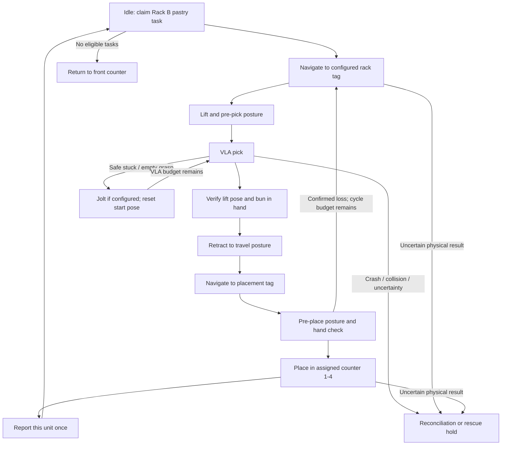

# Humanoid pick-loop flow and decisions

This area implements the Atom-W portion of the original brief as software simulation. The source projects remain reference material. Each platform pastry task represents one unit, with distinct task and order identities; an order quantity does not imply a fixed number of loop iterations.

## Flow

1. While idle, accept one eligible Rack B pastry task. Leave Rack A work to its owner. Retain the platform-assigned counter throughout the task.
2. Resolve the task's rack level and slot to an explicitly simulated AMR tag, then navigate to the pick position.
3. Move lift, torso, head and arms to the configured pre-pick posture.
4. Run VLA picking. Keep local policy retries separate from navigation retries. A stuck policy can request a configured jolt and a return to its start posture before another attempt. Collision, software crash or an uncertain physical outcome requires reconciliation or operator rescue.
5. Require a lift-pose check and a world-derived bun-in-hand check. A policy ending successfully alone does not prove possession.
6. Retract the arm to the pre-pick/travel posture while retaining the bun.
7. Navigate to the configured placement tag, move to the pre-place posture and check possession again.
8. If the bun is confirmed lost before placement, restart the rack path with a bounded whole-cycle retry. Do not count a unit as fulfilled.
9. Place the bun into the assigned counter, then report that unit's completion. Physical placement and platform reporting are separate recovery boundaries.
10. Accept the next eligible task immediately. Return to the front counter only when no eligible work remains and the robot is not in a hold.

## Resolved interpretation

- Counter, box and placement cell name the same destination. Counters 1, 2, 3 and 4 are distinct; counter 4 must never alias another counter.
- Use one complete physical path per pastry task. Do not substitute the current client's batch box-transport workflow.
- A partially fulfilled order retains its actual successful quantity. Failed units do not become fulfilled through cancellation, retries or reporting recovery. Cross-rack work remains outside this harness's authority.
- Retry budgets count additional attempts: one navigation retry means at most two attempts; two VLA retries mean at most three attempts. These defaults are simulation choices within the examples in the brief, not established hardware tuning.
- Tags, joint poses, lift targets, hand selection, policies and counter placement targets are configurable simulation placeholders. No calibrated real coordinates are inferred.
- The visual demonstration must expose the AMR location, posture phase, held bun and destination counter. Visual output accompanies state/event assertions; it is not physical evidence.

## Sources and precedence

The original brief is `C:/Users/andyl/.codex/attachments/5e6e8c35-ec71-4332-a1e3-118d48671599/pasted-text.txt`: Atom flow at lines 55-81; retry and rescue discussion at 84-104; mocking/visual request at 118. The later user decisions in `D:/Work/FPS/Robotics/end-to-end-sim/docs/decisions.md` resolve counter terminology (9-19), retry interpretation (21-29) and partial fulfillment (31-35).

`D:/Work/FPS/Robotics/end-to-end-sim/docs/3rd-party/platform.md:13` describes quantity expansion into per-pastry tasks, Rack B routing and platform-owned counter allocation. `docs/3rd-party/atom.md:22` records the missing integrated lift verification and `:33` identifies the external client executor boundary. `docs/implementation-plan.md:92` describes the intended complete per-pastry Atom executor and `:149` leaves physical configuration open.

These canonical documents are an uncommitted working review snapshot on `main` at `62158af5df09aa25f4c438737a3bd68afe2b849d`, not files present in this task's initial checkout. They were read in place without modification. The harness worktree starts at the same commit on branch `codex/humanoid-pick-loop`.

The related client recovery worktree was reviewed at `a9519cc07dbdd637706640e80158817a208aa0e9` on `codex/durable-completion-recovery`, including startup recovery production commit `16d04079727681f047282c5116298a828000c2a9`. It had an untracked `pending-completions.json`, which this task does not use or modify. Its completion/readback/operator-resolution interfaces provide context, not a runtime dependency or evidence that Atom is integrated.

`docs/non-platform-recovery-follow-up.md:7` documents client-only recovery acceptance. `docs/master-verification-report.md:154` explicitly leaves the complete Atom/Nova scenario untested. This harness must not promote that evidence to hardware or combined-system acceptance.
